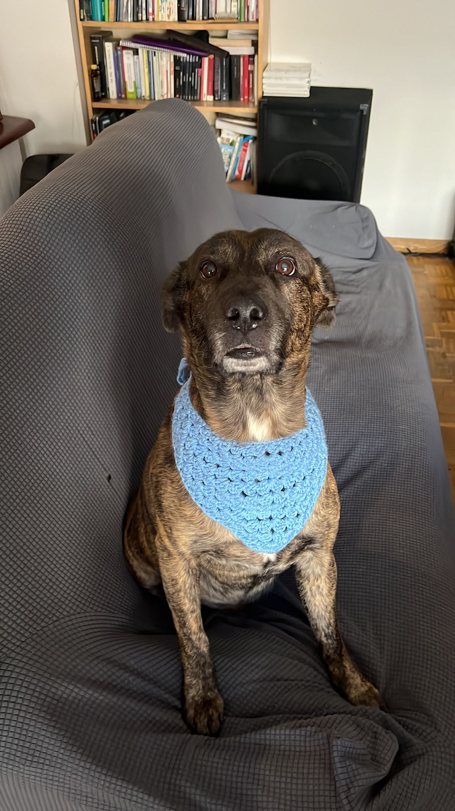

# Project Notes: HTML Basics

---

## Why name the file `index.html`?

- Web servers automatically look for a file named `index.html` as the default entry point for a website.
- Naming it this way ensures compatibility and easy loading when someone accesses your project.

---

## **Key HTML Elements**

### **Basic Structure**

- **`<!DOCTYPE html>`**: Declares the document type as HTML5, all HTML files have to start with this **tag**.
- **`<html>`**: Root element of the HTML document.
- **`<head>`**: Contains metadata, styles, and links to external resources.
- **`<body>`**: Contains all the visible content of the webpage.

### **Common Tags**

- **Headings (`<h1>` to `<h6>`)**:
  - Define the hierarchy of titles and subtitles on a page.
  - `<h1>` is the main title, while `<h6>` is the smallest subheading.
- **Paragraph (`<p>`)**:
  - Used to add blocks of text content.
- **Image (``)**:
  - Displays images on the webpage. You can add [**attributes**](#html-attributes) to some **tags**.

### Semantic Elements

- **Semantic elements** describe the purpose of the content, improving readability for humans and search engines.

  - **`<main>`**: Wraps the main content of the page.

---

## **HTML Attributes**

- **Attributes** are special words used inside the opening **tag** to change their behavior or appearance.
- They are written inside the opening **tag** as **`name="value"`** pairs.

### **Examples of Common Attributes:**

- **`src`**: Specifies the source of the image.
- **`alt`**: Provides alternative text if the image doesn’t load.
- **`width`** & **`height`**: Set the dimensions of the element.

### Example Code

```html
<!DOCTYPE html>
<html>
  <body>
    <h1>HTML Project Freecodecamp</h1>
    <h2>My beautiful Dogs</h2>
    <main>
      <h3>Photoshot Esquitx</h3>
      <p>Click here to view Esquitx pictures</p>
      
      <h3>Photoshot Stormy</h3>
      <p>Click here to view Stormy pictures</p>
      <!-- This is not gonna appear in the final output-->
      
    </main>
  </body>
</html>
```
